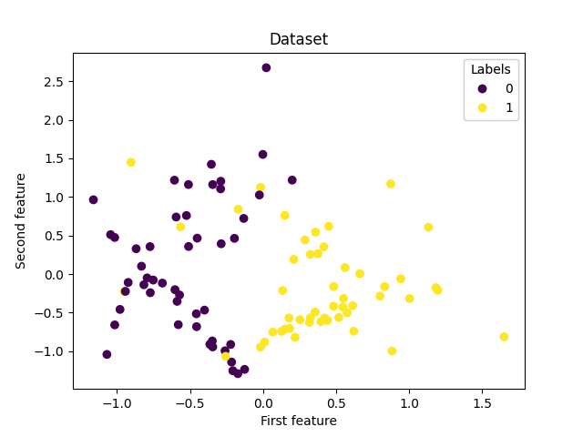

# ES 335 Assignment 0 - Task 1 Question 2: Classification Dataset Analysis

## Overview
In this task, we implement and evaluate our custom decision tree algorithm on a synthetic classification dataset generated using the `make_classification` function from `sklearn.datasets`. The goal is to demonstrate the effectiveness of our decision tree implementation and compare its performance using different evaluation metrics.

## Dataset Description
The dataset is generated with the following characteristics:
- **Samples**: 100 data points
- **Features**: 4 informative features
- **Classes**: 2 (binary classification)
- **Random State**: 42 (for reproducibility)

The dataset is randomly shuffled and split into:
- **Training Set**: 70% (70 samples)
- **Testing Set**: 30% (30 samples)

## Dataset Visualization
The plot below shows the distribution of the generated dataset:



The visualization demonstrates the separability of the two classes in the feature space, which is crucial for understanding the decision tree's performance.

## Part 1: Single Decision Tree Performance

### Model Configuration
- **Maximum Depth**: 5
- **Splitting Criterion**: Information Gain
- **Minimum Samples Split**: 2

### Results
Running our decision tree implementation on the dataset yields the following performance metrics:

<center>
    <table>
        <tr>
            <th colspan="2">Metric</th>
            <th>Value</th>
        </tr>
        <tr>
            <td colspan="2">Overall Accuracy</td>
            <td>0.9667</td>
        </tr>
        <tr>
            <th rowspan="2">Class 0</th>
            <td>Precision</td>
            <td>1.0000</td>
        </tr>
        <tr>
            <td>Recall</td>
            <td>0.9167</td>
        </tr>
        <tr>
            <th rowspan="2">Class 1</th>
            <td>Precision</td>
            <td>0.9474</td>
        </tr>
        <tr>
            <td>Recall</td>
            <td>1.0000</td>
        </tr>
    </table>
</center>

### Performance Analysis
- **High Accuracy**: 96.67% accuracy demonstrates excellent performance on this dataset
- **Balanced Performance**: Both classes show strong precision and recall values
- **Class 0**: Perfect precision (1.0) with high recall (0.9167)
- **Class 1**: Perfect recall (1.0) with high precision (0.9474)

## Part 2: 5-Fold Nested Cross-Validation

To find the optimal depth and ensure robust performance evaluation, we implemented 5-fold nested cross-validation with depth values ranging from 1 to 10.

### Cross-Validation Results
```
Fold 0, Mean Depth Accuracies on Validation {3: 0.9125, 2: 0.9125, 4: 0.875, 5: 0.85, 8: 0.8375, 7: 0.8375, 6: 0.8375, 1: 0.5625}
Fold 0, Accuracy on Test dataset: 0.9

Fold 1, Mean Depth Accuracies on Validation {2: 0.9125, 4: 0.8875, 3: 0.8875, 8: 0.875, 7: 0.875, 6: 0.875, 5: 0.875, 1: 0.85}
Fold 1, Accuracy on Test dataset: 0.8

Fold 2, Mean Depth Accuracies on Validation {2: 0.9, 3: 0.875, 6: 0.8625, 5: 0.8625, 4: 0.8625, 8: 0.85, 7: 0.85, 1: 0.525}
Fold 2, Accuracy on Test dataset: 0.95

Fold 3, Mean Depth Accuracies on Validation {2: 0.8625, 3: 0.85, 4: 0.8125, 8: 0.775, 7: 0.775, 6: 0.775, 5: 0.775, 1: 0.525}
Fold 3, Accuracy on Test dataset: 0.95

Fold 4, Mean Depth Accuracies on Validation {4: 0.8125, 3: 0.8125, 2: 0.8125, 6: 0.7875, 5: 0.7875, 8: 0.775, 7: 0.775, 1: 0.75}
Fold 4, Accuracy on Test dataset: 0.9

Mean Accuracy across 5 folds: 0.90
Optimal Depths per fold: [3, 2, 2, 2, 4]
```

### Key Findings
1. **Optimal Depth**: Depth 2 appears most frequently (3 out of 5 folds) as the optimal choice
2. **Consistent Performance**: Mean accuracy of 90% across all folds shows robust performance
3. **Depth Analysis**: 
   - Shallow depths (1) show poor performance due to underfitting
   - Medium depths (2-4) show optimal performance
   - Deeper depths (5-8) show slight performance degradation, suggesting potential overfitting

### Recommended Model Configuration
Based on the cross-validation results, **depth 2** is recommended as it:
- Appears as optimal in the majority of folds (60%)
- Provides consistent high performance across validation sets
- Balances model complexity with generalization ability
- Reduces risk of overfitting while maintaining predictive power

## Conclusion
Our decision tree implementation demonstrates excellent performance on the classification task, achieving high accuracy and balanced precision-recall metrics. The nested cross-validation approach provides confidence in the model's generalization ability and helps identify the optimal hyperparameters for robust performance.
