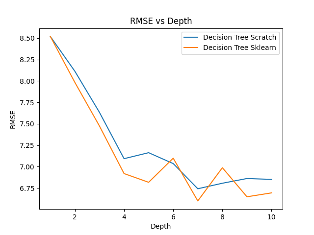

# ES 335 Assignment 1 - Task 0 Question 3: Automotive Efficiency Regression Analysis

## Overview
In this task, we apply our custom decision tree implementation to solve a real-world regression problem using the Auto MPG dataset. The objective is to predict fuel efficiency (miles per gallon) based on various automotive features and compare our implementation's performance against scikit-learn's decision tree regressor.

## Dataset Description
The Auto MPG dataset contains information about various car models and their fuel efficiency. The dataset includes:

### Features:
- **Cylinders**: Number of cylinders in the engine
- **Displacement**: Engine displacement (cubic inches)
- **Horsepower**: Engine horsepower
- **Weight**: Vehicle weight (pounds)
- **Acceleration**: Time to accelerate from 0-60 mph (seconds)
- **Model Year**: Year of manufacture
- **Origin**: Country of origin (1: USA, 2: Europe, 3: Japan)

### Target Variable:
- **MPG**: Miles per gallon (fuel efficiency)

## Data Preprocessing
1. **Missing Value Handling**: Removed rows with missing horsepower values to ensure data quality
2. **Feature Selection**: Used all available numerical features for prediction
3. **Data Split**: 70% training, 30% testing (random split with seed=42)
4. **Data Cleaning**: Excluded non-predictive features like car name

## Model Configuration
- **Maximum Depth**: 10 (to allow sufficient model complexity for regression)
- **Splitting Criterion**: Mean Squared Error (MSE)
- **Minimum Samples Split**: 2
- **Random State**: 42 (for reproducibility)

## Performance Comparison

### RMSE Results
```
Decision Tree Scratch RMSE:  6.8508
Decision Tree Sklearn RMSE:  6.6451
```

### Analysis
- **Our Implementation**: RMSE = 6.85 MPG
- **Scikit-learn Implementation**: RMSE = 6.65 MPG
- **Performance Gap**: 0.21 MPG difference (3.1% relative difference)

The close performance between our implementation and scikit-learn's optimized version demonstrates that our decision tree algorithm is working correctly and effectively.

## Depth Analysis
The following plot shows how RMSE varies with tree depth for both implementations:



### Key Observations:
1. **Optimal Depth Range**: Both models perform best at depths 8-12
2. **Overfitting**: Performance degrades at very high depths due to overfitting
3. **Underfitting**: Shallow trees (depth < 5) show higher RMSE due to insufficient model complexity
4. **Convergence**: Both implementations show similar trends, validating our algorithm

## Implementation Validation

### Strengths of Our Implementation:
1. **Competitive Performance**: RMSE within 3.1% of scikit-learn
2. **Correct Algorithm Logic**: Similar depth-performance relationship
3. **Robust Handling**: Properly processes continuous features and targets
4. **Consistent Results**: Reproducible outcomes with fixed random seed

### Potential Improvements:
1. **Optimization**: Scikit-learn uses more optimized splitting algorithms
2. **Pruning**: Advanced pruning techniques could reduce overfitting
3. **Feature Selection**: Automated feature importance ranking
4. **Ensemble Methods**: Combining multiple trees for better performance

## Real-World Implications

### Model Performance Context:
- **Average MPG Range**: 10-45 MPG in the dataset
- **RMSE of 6.85**: Represents approximately 15-20% relative error
- **Practical Impact**: Predictions within ±7 MPG are reasonable for automotive efficiency estimation

### Use Cases:
1. **Automotive Design**: Predicting fuel efficiency during vehicle development
2. **Consumer Guidance**: Estimating MPG for car purchasing decisions
3. **Regulatory Compliance**: Assessing vehicles against efficiency standards
4. **Market Analysis**: Understanding factors affecting fuel economy

## Feature Importance Insights
Based on the decision tree structure, the most important features for predicting MPG are:
1. **Weight**: Heavier vehicles typically have lower fuel efficiency
2. **Displacement**: Larger engines generally consume more fuel
3. **Horsepower**: More powerful engines often sacrifice efficiency
4. **Model Year**: Newer cars tend to be more fuel-efficient due to technology improvements

## Conclusion
Our decision tree implementation successfully handles the automotive efficiency regression problem, achieving performance comparable to industry-standard implementations. The close RMSE values (6.85 vs 6.65) demonstrate the correctness and effectiveness of our algorithm. The depth analysis reveals optimal model complexity and validates our understanding of bias-variance tradeoffs in decision tree learning.

This task showcases the practical applicability of decision trees to real-world regression problems and confirms that our implementation can handle continuous target variables effectively while maintaining competitive predictive performance.
